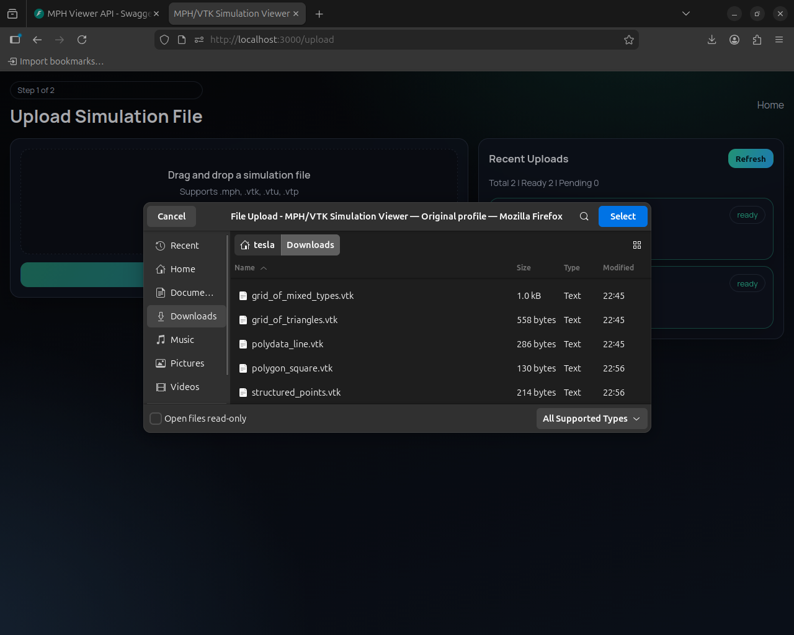
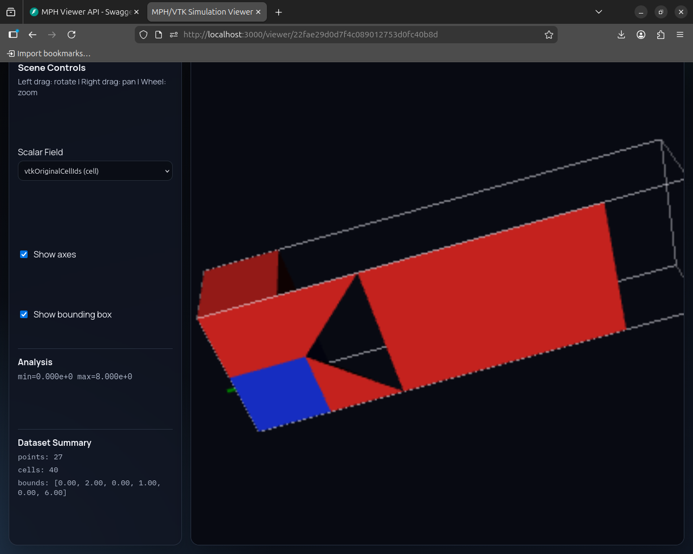
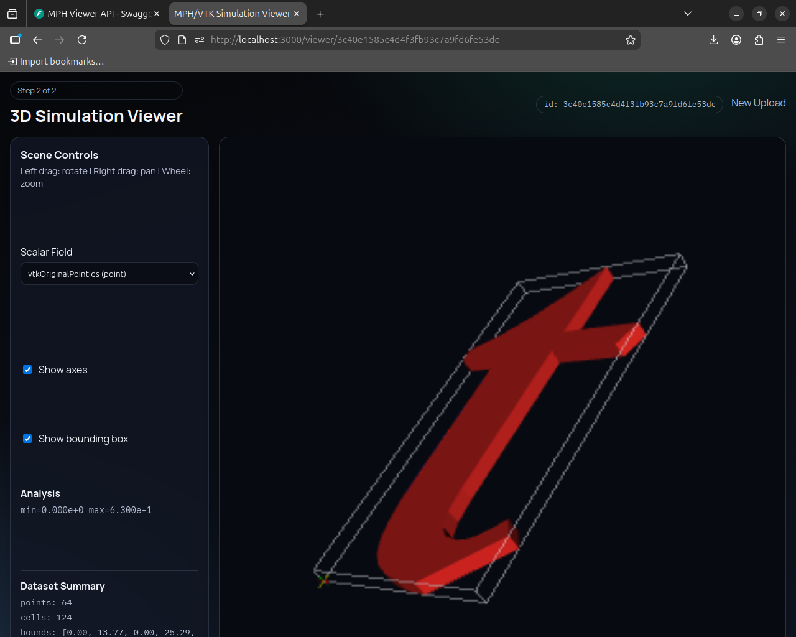

# MPH/VTK Simulation Viewer

A modern full-stack web application for uploading and visualizing simulation datasets in the browser.

This project is built for users who may not have COMSOL installed locally. It supports a practical workflow:

- Upload `.mph`, `.vtk`, `.vtu`, `.vtp`
- Server-side processing/conversion pipeline
- Interactive 3D visualization in browser using `vtk.js`
- Upload history so you can reopen past files without re-uploading

## Screenshots

### Upload + Recent History



### Viewer - Case 1



### Viewer - Case 2



## Tech Stack

### Frontend

- Next.js 14 (App Router)
- TypeScript
- vtk.js with advanced filtering (slice, clip planes)
- Modern responsive UI: Space Grotesk typography, glass-panel design, gradient backgrounds
- Chunked upload with retry logic and real-time progress tracking
- Server-Sent Events (SSE) for conversion progress streaming

### Backend

- FastAPI with async support
- Python 3.12+ with full type hints
- PyVista + meshio for mesh processing
- Local file storage (chunked uploads, processed outputs, metadata)
- Streaming responses for dataset export and progress events

## Project Structure

```text
mph/
├── backend/
│   ├── app/
│   │   ├── main.py
│   │   ├── routes/
│   │   │   └── upload.py
│   │   └── services/
│   │       ├── converter.py
│   │       └── storage.py
│   └── data/
│       ├── uploads/
│       ├── processed/
│       └── meta/
├── frontend/
│   ├── app/
│   │   ├── upload/
│   │   └── viewer/[id]/
│   ├── components/
│   │   ├── FileUploader.tsx
│   │   ├── ControlsPanel.tsx
│   │   └── VTKViewer.tsx
│   └── next.config.mjs
└── docs/screenshots/
```

## Features

### Upload & History
- **Chunked file upload** (5MB chunks with automatic retry, 3 attempts per chunk)
- Per-file **download** and **delete** actions in history
- Upload history with quick-access links
- Real-time progress bar during upload
- Processing status indicator (ready / running / pending conversion)

### 3D Viewer & Visualization
- Drag-and-drop file upload or chunked upload for large files
- `.vtk/.vtu/.vtp` processing and browser rendering
- `.mph` accepted and tracked as `pending_conversion`
- **Interactive 3D controls**: rotate (left drag), pan (right drag), zoom (wheel)
- **Scalar field selection** with color-coded rendering
- **Colormap options**: Rainbow, Viridis, Cool to Warm, Grayscale
- **Scalar range clamping** with manual min/max inputs and auto-reset
- **Clip plane / cross-section tool**:
  - Toggle enable/disable
  - Axis selector (X / Y / Z)
  - Position slider with bounds display
  - Live cross-section visualization
- **Scene toggles**: axes, bounding box visibility
- **Analysis panel**: scalar range (min/max), dataset stats (points, cells, bounds)

### Backend Processing
- Server-side conversion pipeline with **progress streaming** via SSE
- Progress stages: Reading → Converting → Extracting → Saving
- Conversion status persisted in metadata
- Surface extraction and triangulation for optimal rendering

## About COMSOL `.mph` Format

`.mph` is a proprietary COMSOL format and cannot be directly parsed in browser JavaScript.

**Current behavior:**
- `.mph` uploads are accepted, stored, and tracked
- Status shows as `pending_conversion` with guidance message
- **To visualize**: Export from COMSOL to `.vtk`, `.vtu`, or `.vtp` format and upload the exported file

**Viewer indicates:**
- Format detection (📦 COMSOL Format Detected)
- Step-by-step conversion instructions
- Links to external converter services if needed

## API Endpoints

### Upload & Processing

#### `POST /upload`
Accepts simulation file upload (chunked or single-shot) and returns metadata:
- **Single-shot**: Regular FormData upload
- **Chunked**: Requires headers `X-Chunk-Index`, `X-Total-Chunks`, `X-File-Id` (UUID)
- Returns:
  - `id`, `filename`, `status` (`ready` | `processing` | `pending_conversion`)
  - `stats`: points, cells, bounds
  - `scalars`: array of scalar field metadata
  - `message` (if conversion pending)

#### `GET /file/{id}/progress`
Server-Sent Events stream for conversion progress:
- Emits: `{"percent": 0-100, "message": "..."}` JSON events
- Stages: Reading → Converting → Extracting → Saving → Done
- Auto-closes when conversion completes

### Metadata & Downloads

#### `GET /file/{id}`
Returns full metadata for a file:
- All upload metadata + conversion results
- `dataset_url`: `/file/{id}/dataset` if ready

#### `GET /file/{id}/dataset`
Returns processed VTP binary for viewer rendering.

#### `GET /file/{id}/download`
Downloads the original uploaded file with correct filename.

#### `DELETE /file/{id}`
Permanently deletes:
- Metadata JSON
- Processed VTP file  
- Original upload file
- Temporary chunk files
- Progress event history

### History

#### `GET /files?limit=50`
Returns recent uploads (history list), newest first, with full metadata.

## Local Setup

### 1) Backend

```bash
# From project root
python -m venv .venv
source .venv/bin/activate

# Install dependencies
pip install -r requirements.txt

# Start server
python -m uvicorn app.main:app --host 127.0.0.1 --port 8000
```

API docs: http://127.0.0.1:8000/docs

### 2) Frontend

```bash
cd frontend
npm install
NEXT_PUBLIC_API_BASE_URL=http://127.0.0.1:8000 npm run dev
```

App: http://127.0.0.1:3000

## Production Build

### Frontend

```bash
cd frontend
npm run build
npm run start
```

### Backend

```bash
cd backend
source .venv/bin/activate
python -m uvicorn app.main:app --host 0.0.0.0 --port 8000
```

## Performance Notes

- **Chunked uploads**: 5MB chunks stream to disk, retry-safe, resumable
- **Streaming responses**: Dataset and progress use HTTP streaming for low latency
- **Surface extraction**: Backend triangulates and optimizes mesh for web rendering
- **Memory efficient**: Viewer only loads processed `.vtp` (surface), not full volume
- **Scalability**: For very large meshes, decimation/LOD can be added to conversion pipeline

## Recent Enhancements (v1.1+)

✅ **Chunked uploads** with 5MB chunks and automatic retry
✅ **Delete & download** per-file history actions  
✅ **Colormap & scalar range** controls (4 color schemes)
✅ **Clip plane / cross-section** with axis/position control
✅ **SSE progress streaming** for real-time conversion updates
✅ **Modern UI redesign** with glass panels and gradient accents

## Roadmap Ideas

- Time-series playback for transient simulations
- Multi-file comparison mode
- Isosurface extraction and visualization
- Data decimation/LOD for very large meshes
- Export cross-section / slice to file

## Development Notes

- **Type Safety**: Full Python type hints in backend, strict TypeScript in frontend
- **No External libs**: Uses only dependencies in requirements.txt; frontend uses vtk.js already installed
- **Responsive**: Works on desktop and mobile; layouts adapt to viewport
- **Error Handling**: User-friendly error messages for upload/conversion failures

## License

MIT
